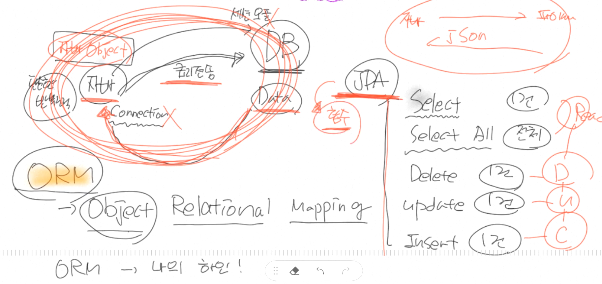

#JPA 개념잡기

### 1. JPA 란?

###JPA 는 Java Persistence API 이다.  
> 영속성이란?
>> RAM (전기) 휘발성 : 컴퓨터가 OFF 되면 사라집니다!..  
> 램의 기억을 하드디스크에 저장함 > **어떠한 데이터가 영구히 기록 되는 것입니다.**  
> 자바에 있는 데이터를 영구히 저장할 수 있는 API  
> 
> >사전적 의미 : 데이터를 생성한 프로그램의 실행이 종료되더라도 사라지지 않는 데이터의 특성을 의미합니다.
> 영속성은 파일 시스템 , 관계형 데이터베이스 혹은 객체 데이터 베이스 등을 활용하여 구현합니다.
>>>API는 뭔가요??    
> 애플리케이션 (Application) ->프로그램  
> 프로그래밍 (P)  -> 프로그래밍  
> 인터페이스 (I) -> 인터페이스 (인터페이스 >> 프로그래밍 >> 프로그램 완성)  

|프로토콜 | 인터페이스|
  |-------|---------|
|약속|약속|
|www >> 수많은 프로토콜이 모여있는 것이 인터넷입니다.|A, B ,C 이제 부터는 연락 할 떄 전화하지 말고 직접 찾아와!|
|A, B ,C A C 가 싫다고하면 .. 대안을 제시합니다. >> 규약 : Email로 통신하자!|a 데이터 사용을 원하면 ~~시까지만! 프로그램( 공유 )|
|A, B , C 의 권리가 동일합니다.|상하 관계가 존재하는 약속|

JPA  
---
Java  
Persistence  
Application Programming Interface  
>> 자바 프로그램을 할때 영구적으로 데이터를 저장하기위해 필요한 인터페이스 ! >> JPA

###JPA는 ORM 기술입니다  

    >ORM 이란?
  >> Object Relational Mapping  
  > 나의 하인!  
  >Class 
    > 

-    ORM <-> TRM (Table Relational Mapping) : 우리가 원래 사용하는 테이블 기반의 매핑 >테이블 생성(1) > 자바 클래스 (2)  
       
     
    ORM은 자바 클래스 토대로 테이블을 조작할 수 있습니다 >자바 클래스(1) > 테이블 DML (2) - 상황이 역전됩니다.  

- Select , Select All , Delete , Update , Insert .. 되게 많이 반복하는 작업입니다..
- 자바 > DB 신분 확인 후 > 세션을 오픈해줍니다 ... 자바가 Connection을 가진 후 ... DB에 쿼리를 전송할 수 있습니다. (원래)
- JPA 는 모든 DML 문을 함수로 제공해서 반복적인 연결을 줄일 수 있습니다.
    
###JPA는 영속성 컨텍스트를 가지고 있다.
####영속성 : 데이터 -> 영구적으로 저장하게 해주는 속성입니다. (DB저장 -- Oracle...MySQL...)
####컨텍스트 : context -> 
>  
자바 > 영속성  컨텍스트 > DB    
> `과일 데이터` SELECT -> 영속성 컨텍스트에 `과일데이터`를 달라고 요청 -> DB에서 `과일데이터`를 SELECT
  
>   
> 
> 만약 `과일 데이터`를 `딸기 데이터`로 변경하는 경우 영속성에서는 `딸기 데이터`로 남아있지만, DB에서는 `사과 데이터`로 남아있을 것입니다.  
> 같은 데이터인데.. 서로 모양이 다르면 `영속성 컨텍스트`를 통해 `Update`문이 자동으로 실행됩니다. > 결국 `딸기 데이터`로 변경되는 것입니다. 
>
###JPA는 DB와 OOP 의 불일치성을 해결하기 위한 방법론을 제공합니다. (DB는 객체저장 불가능)

 

- Class Player 에 Team이라는 오브젝트... 서로 연관

###JPA - OOP 관점에서 모델링을 할 수 있게 해줍니다. (상속 , 컴포지션 , 연관관계)

- 공통되는 클래스를 별도로 빼서 상속하게 한 뒤에 사용이 가능합니다. (**상속**)

###방언 처리가 용이하여 Migration하기가 좋습니다. 유지보수에서도 탁월함

#### - MySQL -- ORACLE 간의 Ansii Join.. Sql문법의 차이가 존재하는데 JPA는 적은 코드의 변경만으로도 마이그레이션이 가능해집니다. 

### JPA는 쉽지만 어렵습니다..
 #### OOP방식의 처리와 새로운 개념으로 어려울 수 있습니다. >> 방대한 데이터의 처리의 경우 내부적인 쿼리가 쓸모없는 SELECT를 날리기에 위험할 수도 있습니다.

 
 
 
 
 
 
 
 
 
 
 
 
 
 
 
 
 
 
 
 
 
 