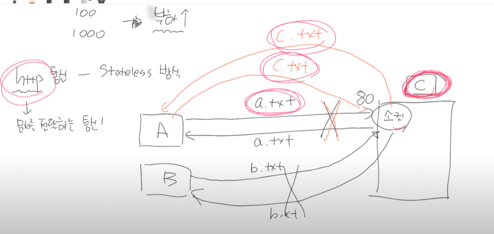

# SPRING

>**[2021-12-08]**<br>
> h2 database 다운로드 완료
> 
> 
---

>**프로젝트 환경 설정**
> <br>
> spring.io 사이트에서 SPRING BOOT 파일을 다운받습니다.
> <br>https://start.spring.io/
>  
> **설정**  
> 
>
> 프로젝트 선택  
Project: Gradle Project  
Spring Boot: 2.3.x  
Language: Java  
Packaging: Jar  
Java: 11  
Project Metadata  
groupId: hello  
artifactId: hello-spring  
Dependencies: Spring Web, Thymeleaf  

---
>**[2021-12-09]**<br>
> 
**프로젝트 실행**  <br>
 <br>
 
 서버 포트 8070으로 변경했습니다.  

---

**스프링 부트 라이브러리 설정**
- 스프링 부트는 그래들 - 메이븐은
- 기본적으로 starter-web 라이브러리만 당기면, 톰캣이나 Spring-Web 등의 라이브러리를 들고오게 됩니다.<br>
<br>
- 
- 이런식으로 무수히 많은 서로 의존관계가 있는 라이브러리들을 한 몇줄의 코드만으로 구현이 가능한 상태로 만들어줍니다.
- 스프링 부트 **톰캣 서버를 내장**


   

spring boot devtools - > https://velog.io/@bread_dd/Spring-Boot-Devtools

웹 개발 기초
- [정적 컨텐츠]
- [MVC와 템플릿 엔진]
- [API]


---
정적컨텐츠
---

### 스프링 부트 개념정리 with JPA

###  스프링이란?

#### 1. 스프링은 *프레임 워크* 이다.

- Frame : 틀 , work : 동작하다
- 너희 마음대로 만들지말고 틀을 벗어나지 않고 만들수 있게 해줄게!


#### 2. 스프링은 *오픈 소스*이다.

- 공개된 소스입니다.
- Contribute (기여) 할 수 있습니다.
- 무료입니다

#### 3. 스프링 *IoC 컨테이너*를 가진다.
#### 4. 스프링 *DI*를 지원한다..

- IoC (Inversion of controll) : 역전의 제어(주도권이 스프링에 있다.)  
- class : 설계도
>object : 실체화가 가능한 것 
>>( 누누 class { 변수   
>                    변수 }) => 누누 실체화 가능 ==> OBJECT (실체화! 게임속에 존재합니다.)
> 
> abstract class
>> 캐릭터 : 추상적인 의미 -- 게임 속에는 존재할 수 없습니다.
>>
>> 가구(abs class) : 1. 의자 : object 2. 침대 : object  
> 
> 오브젝트  
>의자  s = new 의자();  => 오브젝트의 실체화  
> 메서드마다 객체 new되는 순간 heap 메모리에 서로 다른 의자가 생성됩니다  
> 
> >스프링이 의자 , 붕어빵 , 등의 객체들을 읽어서 자동으로 Bean에 등록합니다.

> ####제어의 역전 예시 그림
> 
> #####DI (dependency Injection) 
> 내가 원하는 모든 class 의 method에서 의자, 붕어빵 ,사자 등의 객체를 들고와서 사용할 수 있습니다.
> 클래스에서 사용하는 의자들은 모두 같은 의자가 됩니다. ( ***싱글톤*** )  
>   
> 
- instance : 

#### 5. 스프링은 엄청나게 많은 필터를 가지고 있다.
>
> 톰캣 안에 스프링 컨테이가 존재하는 것은 아니다.  
> 추상적인 스프링 필터 이해를 위한 그림임.  
> 톰캣 : web.xml , 스프링 : 인터셉터(AOP)
> 
#### 6. 스프링은 엄청나게 많은 어노테이션을 가지고 있다. (리플렉션 , 컴파일 체킹)

>1.컴파일 체킹   
> 어노테이션 (주석 + 힌트) << 컴파일러가 무시하지 않습니다.  
>  // 글(주석) << 컴파일러가 무시합니다. (주석+힌트)  
> Animal{ run() }  Dog 상속 
> Animal  
> run  
>
> Animal{ run() }
Dog 상속 >> @override Animal { run ()}  >> 컴파일 (Dog)

@override fly() 사용시 >> 당연히 컴파일 단계에서 오류가 난다.
>
- 스프링 > 어노테이션 >> ~~객체 생성~~
    - @Component >> 메모리에 로딩해!
    - @Autowired >> 로딩된 객체를 해당 변수에 집어 넣어
    - @Controller >>

    ```
    @component
    Class A { // IOC ! 스프링이 메모리에 올려야겠네! 라고 생각한다고함 (어노테이션 기법)
    ;;
    };
  
    

    java
    @Autowired /*>> 나중에 스프링이 B클래스를 스캔할 때 B클래스 내부에 
    어떤 친구가 있는 지 분석하는 기법 >> (리플렉션)
    
    리플렉션 :메서드 : 필드 : 어노테이션 */
    Class B{
    	//A a = new A(); >> 힙메모리에 새로운 객체를 만드는 것입니다
    	
    };
    ```

    - 런타임시에 리플렉션 기법이 시행됩니다

---

---

### 7. 스프링은 MessageConverter를 가지고 있다. 기본값은 *JSON*


- 서로가 알아 들을 수 있는 언어로 번역하는 것이라 생각하면 편하다

- 자바 Object >> JSON >> 파이썬 Object로 변경됩니다.


### 8. 스프링은 BufferedReader , BufferedWriter 를 자유롭게 사용이 가능하다.


-InputStream : 바이트?! >> 문자 (Char) 로 캐스팅해서 처리해야합니다. : InputStreamReader  


### SPRING BOOT 의 동작 원리
#### (1) 내장 톰캣을 가진다.
 - 톰캣을 따로 설치할 필요 없이 바로 실행이 가능합니다.
>Socket : 운영체제가 가지고 있는 것 !  
> >A - B, C 가 통신을 하는 경우 .. 원래 CPU는 한번에 하나의 통신밖에 하지 못합니다  
> 하지만 A CPU에 스레드를 여러개 가용한다면.. => 5000번, 5001번, 5002번 등의 여럿의 스레드를 가용하여
> 동시 통신이 가능해 집니다.  
> **소켓통신** 이라 합니다. : time slice , 동시 동작
>
> Http 통신 - Stateless방식 > 문서를 전달하는 통신!
> 
> a.txt 과 c.txt 를 주고받는 A사용자가 같은 사람인지를 알 수가 없습니다.  
> 이것은 해결하기 위함이.. WebServer 입니다.
> <br>  
> ###HTTP의 탄생
> A 논문을 작성.. 전세계에 있는 자신의 주제와 동일한 내용의 논물을 다 읽어봐야함..  
> 문제해결을 위한 ...  
> <br>
> 팀 버너스 - 모든 컴퓨터간 하나의 서버에 연결하였습니다. > 자기가 쓴 논문을 해당 서버로 업로드 > 해당 논문이 필요하면 검색 & GET  
> `http : html ( 확장자 ) 문서` 주고받는것
> 
 ---
##TOMCAT?
###웹서버가 무엇인가? 

1. HTTP 의 경우 STATIC한 자원.. (html... avi...등의 파일)
    - 요청이 있어야! 응답을 받을 수 있는 구조입니다.
2. 톰캣은 무엇입니까 ??
    - 웹서버 : 아파치 + |톰캣|
    - 컴퓨터 : C\work ...   
    - JSP ( 자바코드 ) >> 톰캣
        - ###톰캣 역할 
        - JSP의 경우 > 자바 > 컴파일   >> html 파일로 변환해서 웹브라우저로 돌려줍니다. 

---

#### (2) 서블릿 컨테이너

- 클라이언트 요청!
- 톰캣이 요청을 받습니다
- 서블릿 컨테이너 요청을 받고
1) 최초 요청이라면 메모리 로딩 . 객체 생성 . 초기화


- a.png => URL 방식 // 스프링에서는 URL방식은 막혀 있습니다.
- picture / a => URI 방식 //Uniform Resource Indentifier 입니다.. //자바파일을 거쳐서 전달됩니다( 스프링 에서는 )


- 톰캣에서 MAXTHREAD 제한이 20개 라면 . .. 아래 그림의 최초 요청이 스레드 20개가 채워질때 까지 반복됩니다.
- 스레드가 20개 초과시 최초 요청에서 > flowChart `NO` 부분을 타며 스레드를 재사용합니다.


### WEB.XML ?
- 문지기 !
#### ServletContext의 초기 파라미터
- 초기 파라미터 : 암구호! `1234` <- 몰래 들어온 사람에 대한 체크!
#### Session의 유효시간 설정
- 웹에서 돌아다닐 수 있는 시간!  
- 
#### Servlet/JSP에 대한 정의
#### Servlet/JSP 매핑
- 해당 주소로 가라는 계시
#### Mine Type 매핑
- GET 방식 : select...(파라미터 有) // 들고온 데이터가 A 이라면
    - 해당 데이터가 어떠한 데이터인지 파악하기 위한 정보가 담겨있는 것은  : Mine Type 이라고 합니다.    
#### Welcome File list
- 처음 입장시 들어가는 페이지
#### Error Pages 처리
-에러 페이지의 처리
#### 리스너/ 필터 설정
- a입장시 a 의 신분을 확인합니다 > 필터링
- 조건이 맞는 경우 바로 해당 연결을 받아들이는 것 > 리스너
#### 보안
- .....


### Dispatcher Servlet 이란?

#### 1. FrontController 패턴
    - 최초 앞단에서 request 요청을 받아서 필요한 클래스에 넘겨준다.
        => web.xml에 정의하기가 힘듭니다.

    - 이때 새로운 요청이 생기기 때문에 request와 response가 새롭게 new 될 수 있습니다. 
    - 그래서 아래의 RequestDispatcher가 필요합니다

#### 2. RequestDispatcher
    - 필요한 클래스 요청이 도달 했을 때 FrontController에 도착한 Req 과 Res 를 그대로 유지 시켜줍니다.

#### 3. DispatchServlet
    - FrontController 패턴을 직접짜거나 RequestDispatcher를 직접 구현 할 필요가 없다. 
        왜냐하면 스프링에는 DispatchServlet 이 있기 때문이다! 

    - 5200 

    - DispatchServlet은 FrontController 패턴 + RequestDispatcher 이다. 

    - DispatchServlet 이 자동 생성될 때 , 수 많은 객체가 생성 (IoC) 된다. 
        보통 필터들인데.. 여기에서 필터들은 내가 직접 등록 할 수도 있고 
        기본적으로 필요한 필터들은 자동으로 등록된다.


### 스프링 컨테이너란??
 DispatchServlet 에 의해 생성되어지는 수 많은 객체들은 어디에서 관리??

1. ApplicationContext
    - 수 많은 객체들이 ApplicationContext 에 등록된다. 이것을 IoC라고 부른다.
    - IoC : 제어의 역전 -DispatchServlet >> ComponentScan >> IoC 가 적용됩니다
    - 개발자가 직접 new로 객체 생성 > 해당 객체를 가르키는 레퍼런스 변수를 관리 X
        - 스프링이 직접 해당 객체 관리 . > 주소를 몰라도 상관 X > 필요할 때  DI 하면 됨.
        - DI : 의존성 주입
            - 필요한 곳에서 ApplicationContext에 접근하여 필요한 객체를 가져올 수 있음.
            - ApplicationContext는 싱글톤으로 관리 > 어디서 접근하던 동일한 객체라는 것을 보장합니다
    + 종류
        1. Root-ApplicationContext
        2. servlet-ApplicationContext
    

2. Bean Factory
    - 필요한객체를 Bean Factory 에 등록할 수도 있습니다 여기에 등록하면 초기에 메모리 로드 X
    - 필요할 때 getBean() ... 이것 또한 IoC입니다..
    - 필요할 때 DI도 가능
    - ApplicationContext와 다른 점은 Bean Factory에 로드되는 객체들은 미리 로드 X
        - 필요할 때 호출하여 로드하기 때문에 Lazy-loading이 됩니다.

### 요청 주소에 따른 적절한 컨트롤러 요청 (Handler Mapping)

- GET 요청 > http://localhost:8080/post/1
- 해당 주소 요청이 오는 경우 적절한 컨트롤러의 함수를 찾아 실행

### 응답

- html파일을 응답할 지 Data를 응답할 지에 대한 결정 >> html파일을 응답하게 되면 , ViewResolver가 관여
- Data를 응답 > MessageConverter 작동

    - html파일의 경우 뷰 리졸버 관여 >> prefix..를 통해 적절한 jsp 반환.
    - @ResponseBody ... 객체등을 Json 형태로 전달도 가능합니다.


## **Spring boot vs Spring

스프링 부트는 스프링 프레임워크에서의 모든 설정을 간결화하기 위하여 사용하는 것입니다.

## Spring Boot 실행 준비..

### 1. Java 설치
1. Chocolatey 이용 ( Scoop 이랑 비슷한 거 같음. )
    - Open JDK 설치...
   
    - 검색해서 ... JDK 와 Maven 설치
### Thymeleaf
    -공홈 DOCS 참고..


- Link 의 경우 해당 타임리프가 해당 link의 주소를 /css ... 로 표현되도록 변환해줍니다.
- th:text ... 말그대로 입니다. >> 다국어 설정하는 경우 사용합니다.

게시물 조회  


게시물 작성  

게시물 작성 반영 (리다이렉트)


게시물 수정  
  


### 에러사항...
1. JPA는 메서드명이 획일화 되어있다.!
    - findByTitleOrContent인 경우 올바른 title 이나 Content를 들고오지만
    - findTitleOrContent 인 경우 파라메터명을 올바르게 인식하지 못하고 findTitle이라는 파라메터를 찾는 바보같은 짓을 한다...

2. 


<br>
<br>
<br>
<br>
<br>
<br>
<br>
<br>
<br>
<br>
<br>
<br>
<br>
<br>
<br>
<br>
<br>
<br>
<br>
<br>
<br>
<br>
<br>
<br>
<br>
<br>
<br>
<br>
<br>


 

  
  