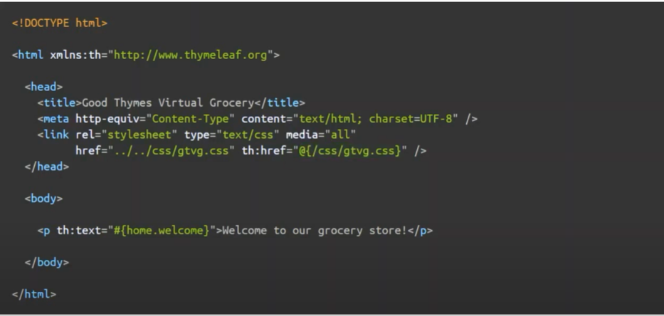
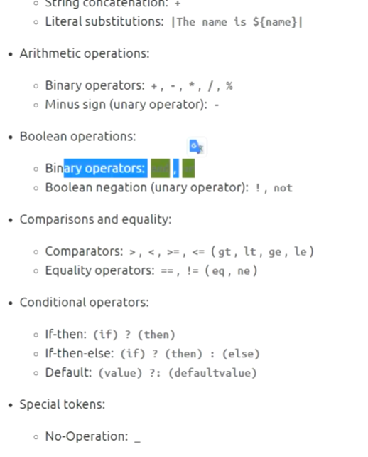
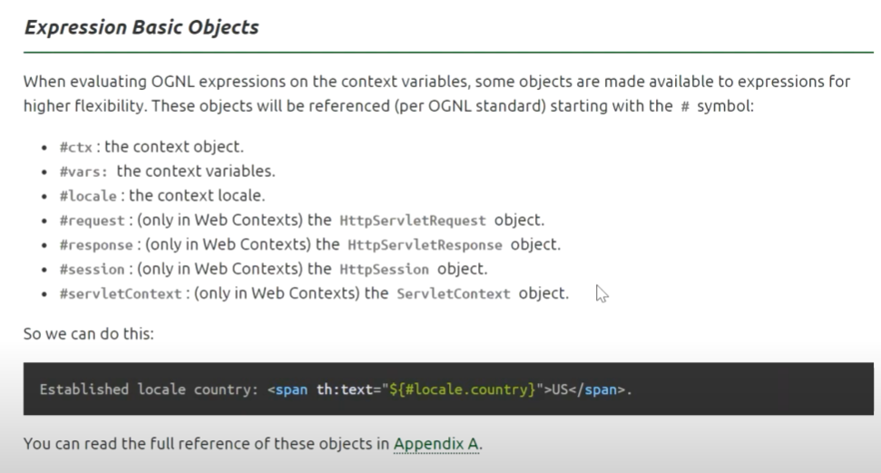
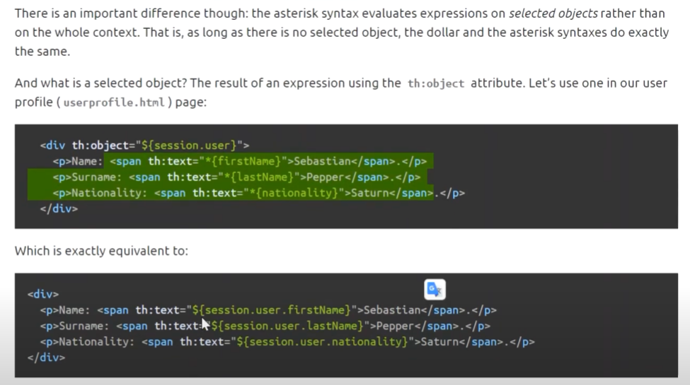

### Thymeleaf
    -공홈 DOCS 참고..

- Link 의 경우 해당 타임리프가 해당 link의 주소를 /css ... 로 표현되도록 변환해줍니다.
- th:text ... 말그대로 입니다. >> 다국어 설정하는 경우 사용합니다.
 
1. 표현식

- ${ ....} : 변수 표현식
- *{...} : Object의 속성값을 나타낼 수 있습니다. 
-#{ ... } : 다국어 지원 메시지..표현 
- @{ ... } : css 경로 
- ~{.... } : 여러 화면에서 사용하는 경우 (공통된 화면 불러올때)

2. 리터럴
    - 숫자 , 불린, 널, 문자...   

---
    

- 사전에 정의된 표현식도 존재합니다 
- jstl 에서의 request... res .. session 과 같습니다.

---

  
- Object선언으로 코드의 간소화 가능합니다.

---
###Spring Boot 실행
1. 스프링 부트 실행시 바로 종료되는 현상  
   - https://smelting.tistory.com/51  
  -  
2. 스프링 부트 css js 루트 반영안되는 현상
   - 전에 설정한다고 다 바꿔놨었다...
   - EnableWebMvc 어노테이션이 적용되어 있어서 그랬던 모양.. 기존의 autoConfig 설정들을 다 덮어버리는거 같던데 자세한 원인은 모르겠습니다.
   - 
3. 

 
 
 
 
 
 
 
 
 
 
 
 
 
 
 
 
 
 
 
 
 
 
 
 
 
 
 
 
 

 

  
  