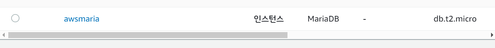
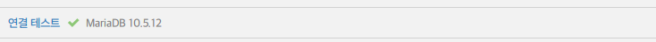
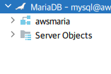
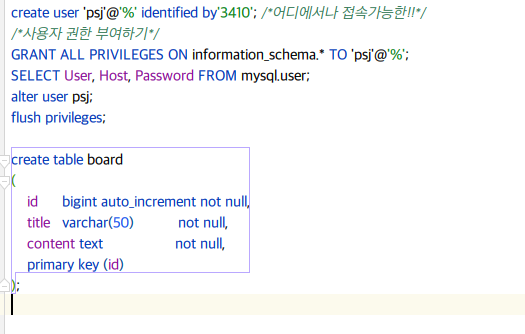

###MARIA DB
1. AWS 에서 cloud 만들기!
    - https://hyeribo.github.io/server/start-mariadb-with-rds/#
    - 결과    
    -  
    - RDS - 마리아 DB -프로젝트랑 연결완료!
    - 
- https://bskyvision.com/1006 -- 사용자 권한 주기  
- board 테이블 생성
- 

